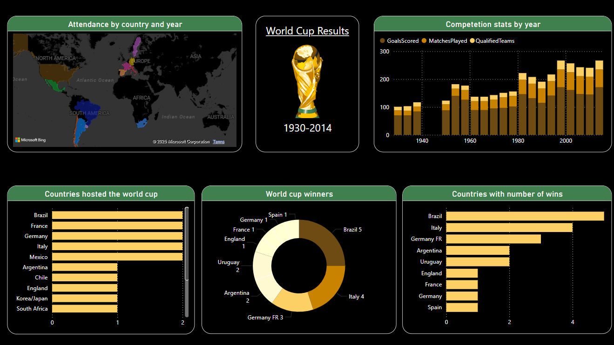
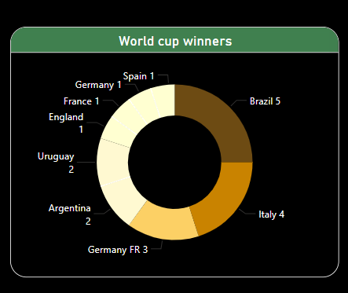
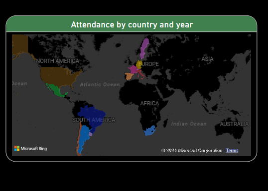
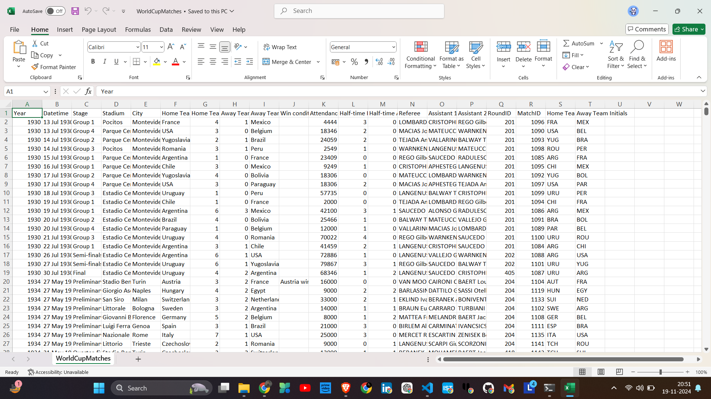
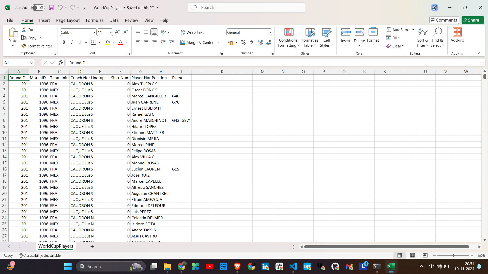
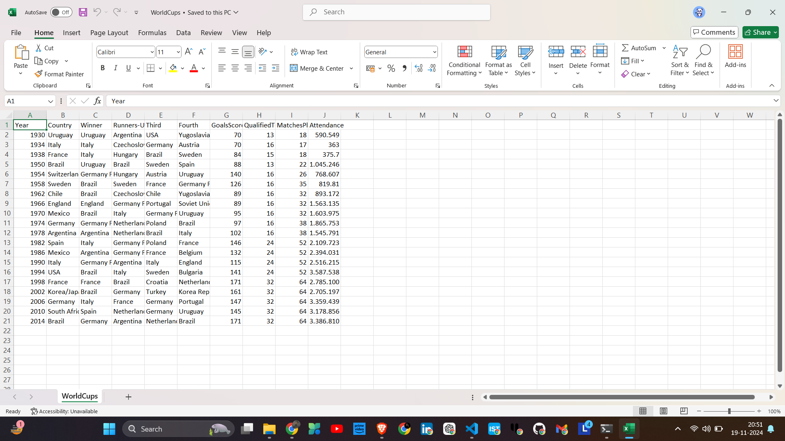

# FIFA World Cup Analysis - Power BI

## 📌 Overview
This Power BI project provides an in-depth analysis of FIFA World Cup history, covering various aspects such as winners, participating countries, performance trends, and key statistics. The dashboard enables users to interactively explore data-driven insights and visualize patterns in World Cup history.

## 🚀 Features
- **Main Dashboard** 📊: A comprehensive view of key statistics.
- **World Cup Winner Chart** 🏆: A graphical representation of past winners.
- **Attended Countries** 🌍: Insights into participating nations over different editions.
- **Data Transformation Process** 🔄: Data cleaning and structuring steps for analysis.

## 📈 Insights
- Historical trends of FIFA World Cup winners.
- Countries with the most appearances and championships.
- Performance comparison of teams across different years.
- Visual representation of key metrics like goals scored, match count, and more.

## 🛠️ Data Transformation Process
The data transformation involved the following steps:
1. **Data Cleaning**: Removed inconsistencies and missing values.
2. **Data Structuring**: Standardized formats and created necessary relationships.
3. **Data Modeling**: Designed Power BI relationships for accurate analysis.

## 🖼️ Screenshots
### 1️⃣ Main Dashboard

### 2️⃣ World Cup Winner Chart

### 3️⃣ Attended Countries

### 4️⃣ Data Transformation - Cleaning

### 5️⃣ Data Transformation - Structuring

### 6️⃣ Data Transformation - Modeling

## 📥 Download the Power BI File
[Click here to download the .pbix file](Presentation/Fifa_world_cup_Analysis.pbix)

## 📥 How to Use
1. Open the Power BI file (`.pbix`).
2. Explore the interactive dashboard and insights.
3. Filter data as needed to analyze specific trends.

## 🔗 Connect with Me
- **GitHub**: [Ganesh Agrahari](https://github.com/ganeshagrahari)
- **LinkedIn**: [Ganesh Agrahari](https://www.linkedin.com/in/ganesh-agrahari-727746263/)

---
📢 *If you like this project, don't forget to ⭐ the repository!* 🚀
